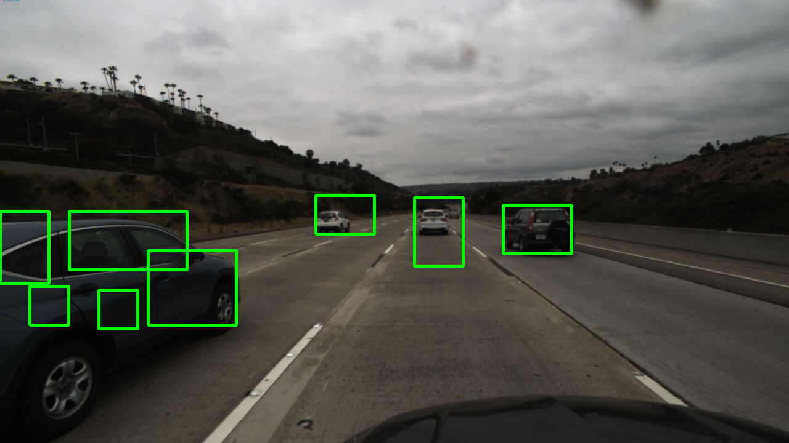
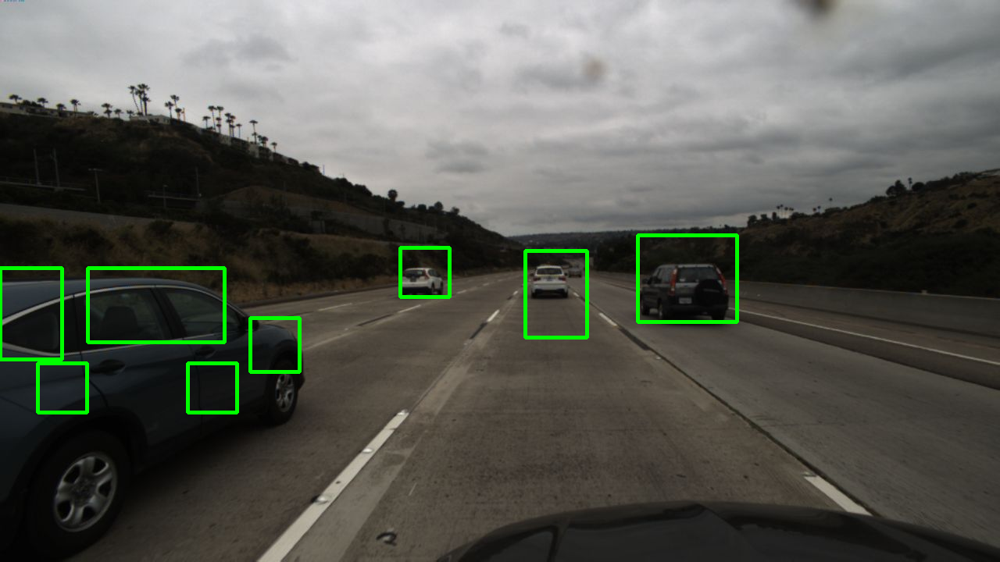

### This assignment is finished on WIN10, due to the non-English directory problem of OpenCV, using the overwrite funcion im_read to read image, using imencode to write image

### Avoiding uploading image file to GitHub, using the absolution directory store the data on other disks. If you want to generating the training images, plz change to relative dir

#### Finally, sorry for bringing troubles!

## How to use it?

#### 1. Using the image_processing.ipynb to generating the training data from the folder

#### 2. Running the Vehicle_Detection.ipynb to do the feature extraction / training / window sliding

## Vehicle Detection Comparison Between Ada SVC and Linear SVC

#### Heat Map and Result of Ada

#### Heat Map and Result of Linear

